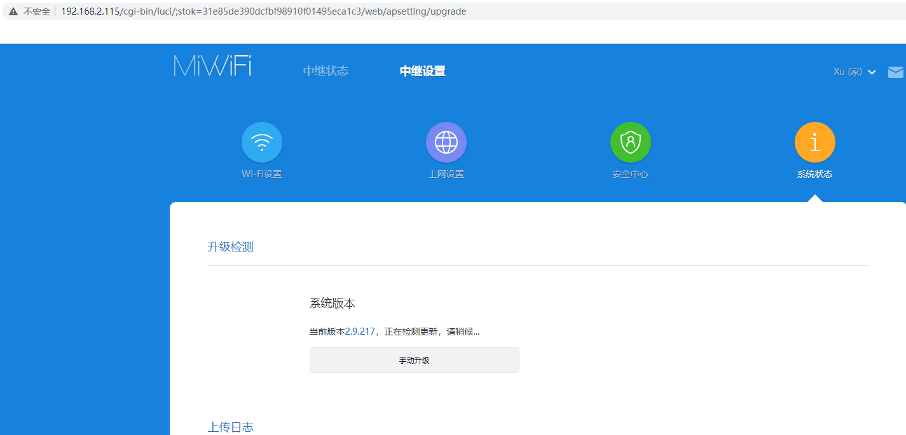
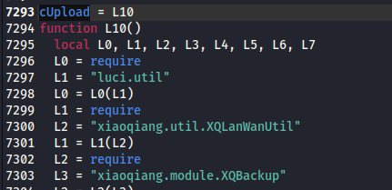
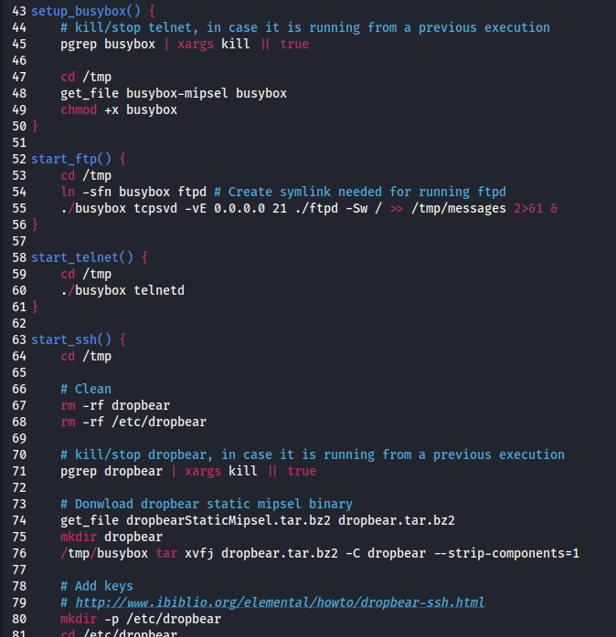
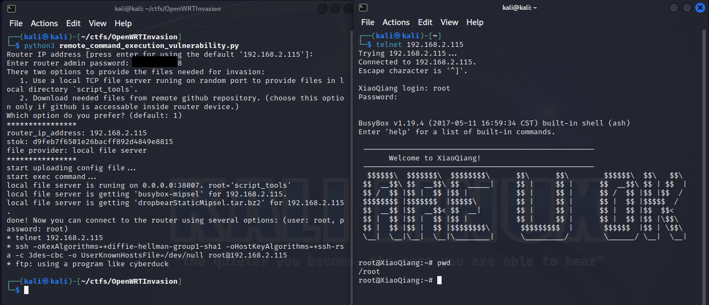

# CVE-2019-18370_XiaoMi_Mi_WIFI_RCE

## 漏洞描述

### 编号

CVE-2019-18370

### 设备信息&固件版本号

**MiRouter 4A Gigabit:**  
2.28.62  
2.28.65  
2.28.132  
3.0.10  
3.0.24  
3.0.27  
3.2.30  
3.10.18  
**MiRouter 4A 100M (non gigabit):**  
2.18.51  
2.18.58  
3.0.12  
**MiRouter 4C:**  
2.14.81  
2.14.87  
2.14.92  
**Mi Router 3Gv2:**  
2.28.8  
**Mi Router 4Q (aka R4C):**  
2.28.48  
**MiWifi 3C:**  
2.8.51_INT  
2.9.217  
2.14.45  
**Mi Router 4:**  
2.18.62  
2.26.175  
**Xiaomi Mi R3P:**  
Xiaomi Dev firmware  
**Xiaomi 3Gv1:**  
The stock firmware coming with the router  
**AC2350 AIOT:**  
1.3.8CN  

### 漏洞类型

RCE  

### 危害

拥有路由器admin账号的攻击者可远程获取机器root权限  

## 复现流程

### 复现设备&固件

XiaoMi Mi Router 3C  
miwifi_r3l_firmware_a5c81_2.9.217.bin/miwifi_r3l_firmware_0b49f_2.14.45.bin(latest)  

### 固件下载&安装

2.9.217  
<http://bigota.miwifi.com/xiaoqiang/rom/r3l/miwifi_r3l_firmware_a5c81_2.9.217.bin>  
or  
2.14.45(latest)  
<https://miuirom.org/miwifi/mi-router-3c>  
  

### 漏洞分析

恢复备份功能将用户上传文件解压至/tmp目录下，并且未对文件做任何过滤，导致用户可上传任意文件至/tmp  
而存在接口从tmp目录下读取文件并拼接内容进os.execute()，导致rce  
binwalk提取固件  
  
反编译lua,找到混淆后的cUpload函数  
_miwifi_r3l_firmware_0b49f_2.14.45.bin.extracted/squashfs-root/usr/lib/lua/luci/controller/api/misystem.lua  
  
  
反混淆后的代码，其中 ```uploadFilepath``` 不可控，但使用```XQBackup.extract(uploadFilepath)```，其对解压内容未作任何过滤  

```lua
function cUpload()
    local LuciFs = require("luci.fs")
    local XQBackup = require("xiaoqiang.module.XQBackup")
    local code = 0
    local canupload = true
    local uploadFilepath = "/tmp/cfgbackup.tar.gz"
    local fileSize = tonumber(LuciHttp.getenv("CONTENT_LENGTH"))
    if fileSize > 102400 then
        canupload = false
    end
    LuciHttp.setfilehandler(
        function(meta, chunk, eof)
            if canupload then
                if not fp then
                    if meta and meta.name == "image" then
                        fp = io.open(uploadFilepath, "w")
                    end
                end
                if chunk then
                    fp:write(chunk)
                end
                if eof then
                    fp:close()
                end
            else
                code = 1630
            end
        end
    )
    if LuciHttp.formvalue("image") and fp then
        code = 0
    end
    local result = {}
    if code == 0 then
        -- extract
        local ext = XQBackup.extract(uploadFilepath)
        if ext == 0 then
            result["des"] = XQBackup.getdes()
        else
            code = 1629
        end
    end
    if code ~= 0 then
        result["msg"] = XQErrorUtil.getErrorMessage(code)
        LuciFs.unlink(uploadFilepath)
    end
    result["code"] = code
    LuciHttp.write_json(result)
end
```

```lua
-- 0:succeed
-- 1:file does not exist
-- 2:no description file
-- 3:no mbu file
function extract(filepath)
    local fs = require("nixio.fs")
    local tarpath = filepath
    if not tarpath then
        tarpath = TARMBUFILE
    end
    if not fs.access(tarpath) then
        return 1
    end
    -- extract
    os.execute("cd /tmp; tar -xzf "..tarpath.." >/dev/null 2>/dev/null")
    os.execute("rm "..tarpath.." >/dev/null 2>/dev/null")
    if not fs.access(DESFILE) then
        return 2
    end
    if not fs.access(MBUFILE) then
        return 3
    end
    return 0
end
```

因此可以实现任意文件上传。  
又存在两接口 /usr/bin/upload_speedtest 和 /usr/bin/download_speedtest ,读取/tmp/speedtest_urls.xml并拼接其中的url进os.execute()  
/usr/bin/download_speedtest  

```lua
#!/usr/bin/env lua
-- ...
local cfg = {
-- ...
    ['xmlfile'] = "/usr/share/speedtest.xml",
        ['tmp_speedtest_xml'] = "/tmp/speedtest_urls.xml",
}
VERSION="__UNDEFINED__"
-- ...
-- 优先使用/usr/share/speedtest.xml
local filename = ""
filexml = io.open(cfg.tmp_speedtest_xml)
if filexml then
    filexml:close()
    filename = cfg.tmp_speedtest_xml
else
    filename = cfg.xmlfile
end

local pp = io.open(filename)
local line = pp:read("*line")
local size = 0
local resources = {}
local u = ""
local pids = {}
-- ...
function wget_work(url)
    local _url = url
    pid = posix.fork()
    if pid < 0 then
        print("fork error")
        return -1
    elseif pid > 0 then
        --print(string.format("child pid %d\n", pid))
    else
        -- 拼接每条url，未作过滤导致rce
        os.execute('for i in $(seq '.. math.floor(cfg.nr/cfg.nc) ..'); do wget '.. url  ..
        " -q -O /dev/null; done")
    end
    return pid
end

while line do
    -- re提取url
    local _, _, url = string.find(line,'<item url="(.*)"/>')
    if url then
        table.insert(resources, url)
    end
    line = pp:read("*line")
end
pp:close()

local urls = mrandom(1, table.getn(resources), cfg.nc)

for k, v in ipairs(urls) do
    if VERSION == "LESSMEM" then
        local pid = wget_work_loop(resources[v])
    else
        -- VERSION 为 __UNDEFINED__， 调用wget_work()
        local pid = wget_work(resources[v])
    end
    if(pid == 0) then
        os.exit(0)
    elseif(pid == -1) then
        done()
    end
end
```

备份、恢复功能  
  
接口 /cgi-bin/luci/;stok={}/api/misystem/c_upload  
  
打包包含payload的speedtest_urls.xml文件  
  
调用测速接口 /cgi-bin/luci/;stok={}/api/xqnetdetect/netspeed，触发rce  
  
rce利用脚本,起ftp、telnet、ssh服务  
  

### 漏洞利用
  
由于攻击需要借助本地文件服务，需要保证攻击者和路由器双向可达。(虚拟机不能NAT，需要桥接)  
攻击脚本  
<https://github.com/FzBacon/CVE-2019-18370_XiaoMi_Mi_WIFI_RCE>  
输入路由器admin ip和admin pwd，可选起本地文件服务或远程文件作为payload  
  
攻击成功会开启三个服务，telnet、ssh、ftp，可按照生成的口令等信息利用，最终获得root权限的shell等。  
  

### 疑问

逆向lua反混淆  
